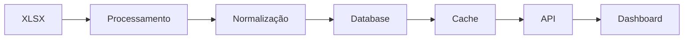

# 📊 Dashboard de Análise de Contratos

[](https://fastapi.tiangolo.com)
[](https://python.org)
[](https://sqlite.org)
[](https://plotly.com)

> 🚀 Sistema avançado de análise de contratos com dashboard em tempo real, processamento de dados XLSX e visualizações interativas.

## ✨ Características Principais

- 📈 **Dashboard Interativo**
  - Gráficos em tempo real com Plotly
  - Filtros dinâmicos
  - Atualizações via WebSocket

- 📊 **Processamento de Dados**
  - Importação de arquivos XLSX
  - Normalização automática
  - Validação de dados

- 🔄 **Atualizações em Tempo Real**
  - WebSockets para dados ao vivo
  - Cache inteligente
  - Notificações em tempo real

- 🛡️ **Recursos Avançados**
  - Sistema de logs robusto
  - Compressão GZip
  - Tratamento de erros avançado

## 🚀 Começando

### Pré-requisitos

```bash
# Python 3.9 ou superior
python --version

# Ambiente virtual
python -m venv .venv
```

### Instalação

```bash
# Ativar ambiente virtual
# Windows
.venv\Scripts\activate

# Instalar dependências
pip install -r requirements.txt

# Iniciar o servidor
python app.py
```

## 🏗️ Estrutura do Projeto

```
relatoriotest/
├── app.py              # Aplicação principal FastAPI
├── models/            # Modelos SQLAlchemy
├── templates/         # Templates HTML
├── static/           # Arquivos estáticos
├── tests/            # Testes unitários
└── requirements.txt  # Dependências
```

## 📚 Documentação da API

### Endpoints Principais

#### GET /api/metrics
```python
GET /api/metrics?start_date=2024-01-01&end_date=2024-12-31
```
Retorna métricas filtradas por data com cache inteligente.

#### WebSocket /ws
```python
ws://localhost:8001/ws
```
Conexão WebSocket para atualizações em tempo real.

## 📈 Visualizações Disponíveis

### 1. Status dos Contratos
- 🟢 Verificados
- 🔵 Em Análise
- 🟡 Aprovados
- ⚪ Pendentes
- 🟣 Quitados
- 🔴 Apreendidos

### 2. Métricas Temporais
- 📊 Gráficos de tendência
- 📈 Análise de progressão
- 📉 Comparativos mensais

## ⚙️ Configuração Avançada

### Variáveis de Ambiente
```env
DATABASE_URL=sqlite+aiosqlite:///./sql_app.db
PORT=8001
DEBUG=true
LOG_LEVEL=INFO
```

### Cache
```python
# Configuração de Cache
CACHE_TTL=300  # 5 minutos
CACHE_MAX_SIZE=100
```

## 🔒 Segurança

- ✅ Validação de dados
- 🔐 Sanitização de inputs
- 🛡️ Proteção contra injeção SQL
- 🔒 Rate limiting

## 🚦 Status do Projeto

- ✅ Configuração inicial
- ✅ API REST básica
- ✅ Processamento XLSX
- ✅ WebSockets
- 🟡 Autenticação
- 🟡 Testes automatizados
- ⚪ Documentação completa

## 📝 Logs e Monitoramento

```python
# Exemplo de log estruturado
{
    "timestamp": "2024-01-20T10:00:00",
    "level": "INFO",
    "event": "metric_update",
    "data": {
        "contracts": 150,
        "processed": 145,
        "pending": 5
    }
}
```

## 🔄 Pipeline de Dados



## 🎯 Próximos Passos

1. 📊 Migração para PostgreSQL
2. 🔐 Implementação de autenticação
3. 📈 Análises preditivas
4. 📱 Interface mobile
5. 🔄 CI/CD pipeline

## 🤝 Contribuindo

1. Fork o projeto
2. Crie sua Feature Branch (`git checkout -b feature/AmazingFeature`)
3. Commit suas mudanças (`git commit -m 'Add some AmazingFeature'`)
4. Push para a Branch (`git push origin feature/AmazingFeature`)
5. Abra um Pull Request

## 📫 Suporte

- 📧 Email: igorofyeshua@gmail.com
- 📱 Telegram: [@manfullwell]

## 📄 Licença

Este projeto está sob a licença MIT. Veja o arquivo [LICENSE](LICENSE) para mais detalhes.

---

<p align="center">
  by: Igor Soares
</p>

<p align="center">
  Desenvolvido com ❤️ pela Equipe de Desenvolvimento
</p>

<p align="center">
  <a href="#-características-principais">Topo</a> •
  <a href="#-começando">Instalação</a> •
  <a href="#-documentação-da-api">API</a> •
  <a href="#-contribuindo">Contribuir</a>
</p> 